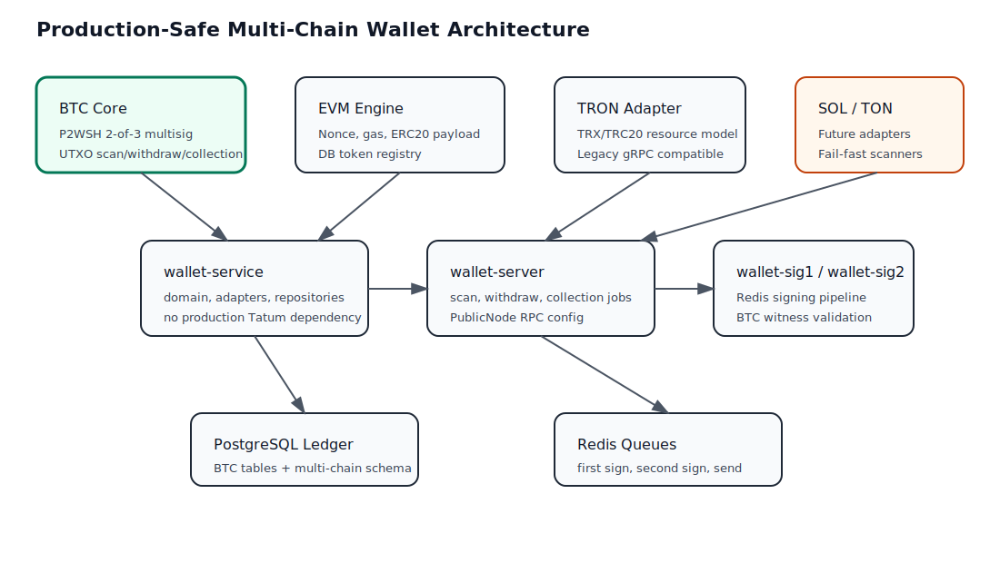
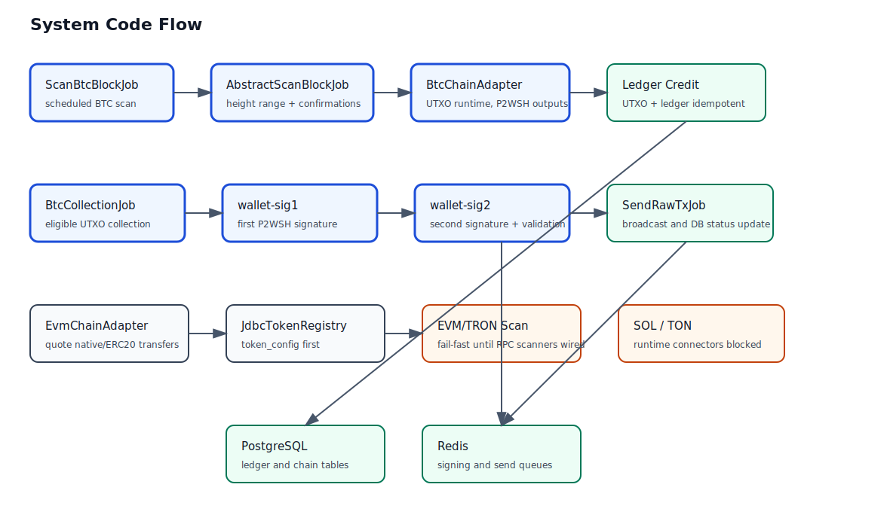

# Surprising Wallet

面向交易所、支付、电商等业务的多租户区块链托管基础设施。一套钱包服务可以同时服务多个租户。

[多租户托管模型](resources/docs/zh/multi-tenant-custody.md) ·
[API 契约](resources/docs/openapi/custody-v1.yaml) · [文档索引](resources/docs/README_CN.md)



## 核心流程



## 产品边界

Surprising Wallet 负责：

- 租户隔离的确定性充值地址；
- 扫链、确认后充值入账、链上余额、提现和对账；
- 租户预充值原生币的 Gas 账户，以及提现手续费预留与结算；
- API 请求签名、防重放、IP 白名单、Console 会话和审计日志；
- 带签名、完整尝试历史、自动重试和手动重放能力的充提 Webhook。

租户自己管理客户、商户、订单和内部余额规则。分配地址时，租户只需传入不透明的
`externalReference`；钱包基础设施不会创建或建模租户内部用户。

```text
租户凭证 + chain + externalReference -> 稳定的唯一充值地址
链上充值 -> tenant + externalReference -> 签名 Webhook
```

## 仓库

- 后端：当前仓库
- React + Ant Design Console：[surprising-wallet-web](https://github.com/lilaizhencn/surprising-wallet-web)

## 项目结构

```
surprising-wallet/
├── pom.xml              # 父 POM：版本、依赖管理、模块聚合
├── common/              # 共享基础设施
├── chain-sdks/           # Bitcoin-like 和 TRON 链 SDK
├── wallet-sig1/          # 第一签名服务
├── wallet-sig2/          # 第二签名服务
├── wallet-service/       # 链适配与业务逻辑
├── wallet-api/           # HTTP API 与定时任务
└── resources/docs/      # 文档、OpenAPI、数据库脚本
```

### 模块职责

| 模块 | 职责 |
|---|---|
| `common` | Redis 封装、链数据模型、钱包密钥配置、Ed25519 密钥派生、Ethereum 密码学工具、Spring 基础设施 |
| `chain-sdks` | Bitcoin-like 链和 TRON 链 SDK：多签地址、SegWit 交易、UTXO 选择、BIP32、gRPC 客户端、Protobuf 合约、ECKey 密码学 |
| `wallet-sig1` | 第一轮签名服务：对 BTC、BCH、LTC、DOGE 提现交易生成部分签名，轮询 Redis 队列获取待签任务 |
| `wallet-sig2` | 第二轮签名服务：对 BTC、BCH、LTC、DOGE、ETH、ERC20、TRON 交易完成最终签名并广播 |
| `wallet-service` | 链适配器（Bitcoin-like/EVM/TRON/Solana/TON/Aptos/Sui/XRP/Cardano/Polkadot/NEAR/Monero/HyperEVM/HyperCore）、扫链充值、账本管理、提现流程、UTXO 归集、Gas 估算 |
| `wallet-api` | Custody REST API、Console 管理后台、充值扫描任务、提现批处理、Gas 对账、Webhook 投递、EIP-7702 归集与提现、启动校验 |

运行模型覆盖 27 条链、14 个链族：

| 链族 | 链 |
|------|-----|
| Bitcoin-like UTXO | BTC, LTC, DOGE, BCH |
| EVM | ETH, BNB, POLYGON |
| EVM L2 | ARBITRUM, OPTIMISM, BASE, AVAX_C, MANTLE, LINEA, SCROLL, UNICHAIN, HyperEVM |
| TRON | TRON |
| Solana | SOL |
| TON | TON |
| Aptos | APT |
| Sui | SUI |
| XRP | XRP |
| Cardano | ADA |
| Polkadot | DOT |
| NEAR | NEAR |
| Monero | XMR |
| HyperCore | HYPE |

实际启用的网络和资产由数据库控制。

## 本地启动

依赖 JDK 21、Maven、PostgreSQL 和 Redis。

```bash
# 初始化数据库
# psql -U wallet -d wallet -f resources/docs/db/surprising-wallet-init-pgsql.sql

# 编译并打包
mvn -pl wallet-api -am package

# 启动
java -jar wallet-api/target/wallet-api-1.0.0-SNAPSHOT.jar
```

Custody 必需密钥：

```text
SW_CUSTODY_SECRET_MASTER_KEY   32 字节 Base64 或 64 位十六进制密钥
SW_CUSTODY_PLATFORM_ADMIN_EMAIL
SW_CUSTODY_PLATFORM_ADMIN_PASSWORD
```

数据库、Redis、HTTP、CORS、链密钥配置和生产启动要求见
[启动与测试](resources/docs/zh/startup-and-testing.md)。

## 验证

```bash
# 运行测试
mvn -pl wallet-api -am test

# 编译全部模块
mvn compile
```

真实链测试需要有余额的测试地址，并受外部 RPC/Faucet 可用性影响，因此默认不运行。
参见[脚本与 Regtest](resources/docs/zh/scripts-and-regtest.md)。
