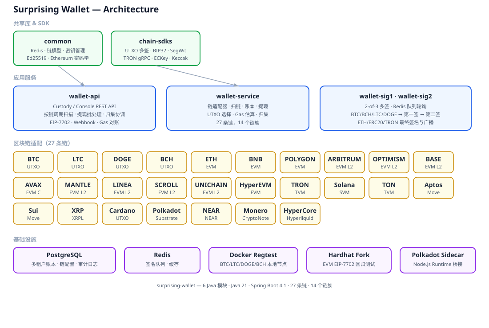
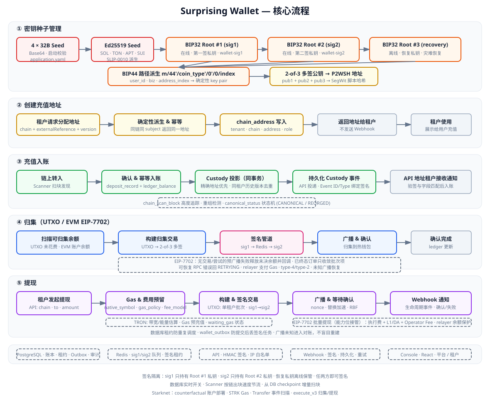

# Surprising Wallet

面向交易所、支付、电商等业务的多租户区块链托管基础设施。一套钱包服务可以同时服务多个租户。

[多租户托管模型](resources/docs/zh/multi-tenant-custody.md) ·
[API 契约](resources/docs/openapi/custody-v1.yaml) · [文档索引](resources/docs/README_CN.md)



## 核心流程



## 产品边界

Surprising Wallet 负责：

- 租户隔离的确定性充值地址；
- 扫链、确认后充值入账、链上余额、提现和对账；
- 租户预充值原生币的 Gas 账户，以及提现手续费预留与结算；
- API 请求签名、防重放、IP 白名单、Console 会话和审计日志；
- 带签名、完整尝试历史、自动重试和手动重放能力的充提 Webhook。

租户自己管理客户、商户、订单和内部余额规则。分配地址时，租户只需传入不透明的
`externalReference`；钱包基础设施不会创建或建模租户内部用户。

```text
租户凭证 + chain + externalReference -> 稳定的唯一充值地址
链上充值 -> tenant + externalReference -> 签名 Webhook
```

## 仓库

- 后端：当前仓库
- React + Ant Design Console：[surprising-wallet-web](https://github.com/lilaizhencn/surprising-wallet-web)

## 项目结构

```
surprising-wallet/
├── pom.xml              # 父 POM：版本、依赖管理、模块聚合
├── common/              # 共享基础设施
├── chain-sdks/           # Bitcoin-like 和 TRON 链 SDK
├── wallet-sig1/          # 第一签名服务
├── wallet-sig2/          # 第二签名服务
├── wallet-api/           # MVC 应用：HTTP API、定时任务、业务逻辑与链适配
└── resources/docs/      # 文档、OpenAPI、数据库脚本
```

### 模块职责

| 模块 | 职责 |
|---|---|
| `common` | Redis 封装、链数据模型、钱包密钥配置、Ed25519 密钥派生、Ethereum 密码学工具、Spring 基础设施 |
| `chain-sdks` | Bitcoin-like 链和 TRON 链 SDK：多签地址、SegWit 交易、UTXO 选择、BIP32、gRPC 客户端、Protobuf 合约、ECKey 密码学 |
| `wallet-sig1` | 第一轮签名服务：对 BTC、BCH、LTC、DOGE 提现交易生成部分签名，轮询 Redis 队列获取待签任务 |
| `wallet-sig2` | 第二轮签名服务：对 BTC、BCH、LTC、DOGE、ETH、ERC20、TRON 交易完成最终签名并广播 |
| `wallet-api` | Spring MVC 单体应用：Custody REST API、Console 管理后台、充值扫描任务、提现批处理、业务服务、链适配器、数据访问、Gas 对账、Webhook 投递、EIP-7702 归集与提现、启动校验 |

运行模型覆盖 50 条链、14 个链族：

| 链族 | 链 |
|------|-----|
| Bitcoin-like UTXO | BTC, LTC, DOGE, BCH |
| EVM | ETH, BNB, POLYGON, BERACHAIN, GNOSIS, MONAD, OASIS_EMERALD, CRONOS, SONIC, PULSECHAIN, ZETACHAIN, CORE |
| EVM L2 | ARBITRUM, OPTIMISM, BASE, AVAX_C, MANTLE, LINEA, SCROLL, UNICHAIN, HyperEVM, CELO, WORLD_CHAIN, INK, TAIKO, SONEIUM, MODE, LISK, KATANA, MEGAETH, X_LAYER |
| TRON | TRON |
| Solana | SOL |
| TON | TON |
| Aptos | APT |
| Sui | SUI |
| XRP | XRP |
| Cardano | ADA |
| Polkadot | DOT |
| NEAR | NEAR |
| Monero | XMR |
| HyperCore | HYPE |

实际启用的网络和资产由数据库控制。

## 本地启动

依赖 JDK 25、Maven、PostgreSQL 和 Redis。

```bash
# 初始化数据库
# psql -U wallet -d wallet -f resources/docs/db/surprising-wallet-init-pgsql.sql

# 编译并打包
mvn -pl wallet-api -am package

# 启动
java -jar wallet-api/target/wallet-api-1.0.0-SNAPSHOT.jar
```

Custody 必需密钥：

```text
SW_CUSTODY_SECRET_MASTER_KEY   32 字节 Base64 或 64 位十六进制密钥
SW_CUSTODY_PLATFORM_ADMIN_EMAIL
SW_CUSTODY_PLATFORM_ADMIN_PASSWORD
```

数据库、Redis、HTTP、CORS、链密钥配置和生产启动要求见
[启动与测试](resources/docs/zh/startup-and-testing.md)。

## 验证

```bash
# 运行测试
mvn -pl wallet-api -am test

# 编译全部模块
mvn compile
```

真实链测试需要有余额的测试地址，并受外部 RPC/Faucet 可用性影响，因此默认不运行。
参见[脚本与 Regtest](resources/docs/zh/scripts-and-regtest.md)。

## 接下来的计划 TODO
### 一、非链路接入类计划（先）
1. 规划并接入 oracle 预言机、MPC 方案、跨链桥；为每条已接入链建立独立文档（生态、技术活跃度、开发者社区、类库资料，尤其补齐 Java）。
2. 统一各环境配置入库（如 Token 配置）并保持环境一致性，新增配置更新机制，不允许配置散落，关于确认数之类的配置需要参考 binance okx 等交易所的确认策略。在 web 端管理员可以管理每个链和链上 tokens的配置和租户端可以查看链和 tokens的配置信息。这些数据由于基本不会变，所以直接在 initsql 里添加为初始化数据即可。
3. 强化后台 web 端链上合约治理：合约编辑、合约审计、合约部署、发布前安全评审。
4. 提升回调稳定性与可观测性，审查代码实现是否足够稳健和安全；明确 EVM7702 充提回调与审计策略，并在 API 文档中补充回调策略与失败恢复说明。

需要对以下所有的链查询最新的各个链的状态，确认是 L1 L2 以及每个链的原生 gas 币名字和简称和其他配置信息，以及官方网站和社区地址
是否有无法接入的也要标记出来并说明原因。是否开源等等。以及这些链上目前有发行什么。
### 二、待接入网络研究清单（2026-07-26 复核）

> 本节只记录网络级接入对象。资料以项目官方文档、官网或基金会公告为准；`L2/L3` 沿用项目官方定位，不等同于对其安全性或去中心化程度背书。
>
> `Gas 资产` 指普通用户直接签名交易时默认扣除的资产；Paymaster、代付、Gasless 和 Fee Abstraction 单独写在 `Gas 模式` 中。正式接入前仍必须复核 chain ID、主网 RPC、归档能力、最终性、重组处理、原生币精度、Token 标准、浏览器和节点运维方案。

状态约定：

- `候选`：存在可验证主网和官方开发资料，可进入技术评估。
- `专项`：不是标准 EVM 链，或地址、交易、Gas/最终性模型特殊，必须单独设计适配器。
- `尽调`：主网或资料存在，但成熟度、持续运营、节点来源或文档质量不足，不进入近期排期。
- `暂停`：被替代、目标网络含糊，或无法从官方资料确认可安全接入。


#### 1. Ethereum 生态 L2 / L3

| 网络 | 层级/网络形态 | Gas 资产 | Gas 模式 | 生态/执行环境 | 官方入口 | 状态与备注 |
|---|---|---|---|---|---|---|
| Abstract | ZK Stack L2 | ETH | ETH | Ethereum / ZKsync VM | [Docs](https://docs.abs.xyz/connect-to-abstract) | 暂缓；主网 `2741`、测试网 `11124` 仍活跃，但主网 EIP-7702 live 门禁被 ZKsync VM 拒绝并返回 `invalid sender. can.t start a transaction from a non-account`；官方合约开发要求 `zksolc/hardhat-zksync`，不符合当前标准 Hardhat/EIP-7702 接入路径，且本轮不新增专用架构 |
| ZKsync Era | ZK Rollup L2 | ETH | ETH | Ethereum / ZK Stack / EraVM | [Docs](https://docs.zksync.io/zksync-network/zksync-era/network-details) | 暂缓；主网 `324`、Sepolia `300` 仍活跃，但主网 EIP-7702 live 门禁被 EraVM 拒绝并返回 `invalid sender. can.t start a transaction from a non-account`；原生账户抽象不等同于 type-4，官方开发还依赖 ZKsync 专用编译与交易体系，本轮不新增专用架构 |
| Metis Andromeda | Optimistic Rollup L2 | METIS | 原生币 | Ethereum / Metis Rollup | [Docs](https://docs.metis.io/andromeda/dapp/start/environment) | 暂缓；主网 `1088` 仍活跃，但 EIP-7702 live 门禁实测忽略 `authorizationList`，按普通转账返回 `21000` Gas；官方 Pectra 说明针对 Hyperion，不能视为 Andromeda 已支持 type-4，等待主网升级后再接入 |
| Boba Ethereum | OP Stack L2 | ETH | ETH | Ethereum / OP Stack | [Official](https://github.com/bobanetwork/boba) | 暂缓；当前 canonical Ethereum L2 主网 `288` 仍活跃，但 EIP-7702 live 门禁返回 `invalid opcode: opcode 0xef not defined`，确认尚未支持 type-4 授权委托；等待 op-geth 主网升级后再接入，历史多链部署不再列为主网 |
| Manta Pacific | Modular/ZK Rollup L2 | ETH | ETH | Ethereum / EVM / Celestia DA | [Docs](https://docs.manta.network/) | 暂缓；主网 `169` 仍活跃，但 EIP-7702 live 门禁返回 `invalid opcode: opcode 0xef not defined`，确认当前执行层尚未支持 type-4 授权委托；等待主网升级后再接入 |
| ApeChain | Arbitrum Orbit L3 | APE | 自定义原生 Gas 币 | Ethereum / Arbitrum / EVM | [Docs](https://docs.apechain.com/) | 暂缓；主网 `33139` 的官方 RPC 返回 `invalid opcode: opcode 0xef not defined`，Curtis `33111` 的 authorization gas 估算仍为 `21000`，两者均未通过项目 EIP-7702 门禁；主网实测约 0.65 秒出块 |
| Shibarium | Ethereum L2 | BONE | 自定义原生 Gas 币 | Ethereum / EVM / Shiba | [Docs](https://docs.shib.io/) | 暂缓；主网 `109` 与 Puppynet `157` 的官方 RPC 均未通过 EIP-7702 authorization intrinsic gas 门禁（仍返回 `21000`）；主网实测约 10 秒出块；官方 USDC／USDT 地址已核实，待链升级后复测接入 |
| Sophon | Ethereum L2 Validium（ZK Stack） | SOPH | 自定义原生 Gas 币 | Ethereum / ZKsync Elastic Chain / EVM | [Docs](https://docs.sophon.xyz/tokenomics/soph) | 暂缓；主网 `50104` 对带／不带 `authorizationList` 的 Gas 估算均为 `0x248ad`，未执行 EIP-7702 intrinsic gas 语义；测试网 `531050104` 的两个官方 RPC 均存在证书域名失配；官方 USDC／USDT 地址已核实，待 ZK Stack 交易模型专项适配后接入 |
| Starknet | Ethereum L2（ZK Rollup） | STRK | 自 v0.14.0 起只允许 STRK 付费 | Ethereum / CairoVM | [Docs](https://docs.starknet.io/learn/protocol/strk) | 专项；旧资料中的 ETH/STRK 双 Gas 已过期，地址和交易模型非 EVM |
| Fuel Ignition | Ethereum L2（Optimistic Rollup） | ETH | FuelVM 基础资产 | Ethereum / FuelVM / UTXO | [Docs](https://docs.fuel.network/guides/user-quickstart/) | 专项；不是 EVM，使用 Fuel 地址、UTXO 和 GraphQL RPC |

#### 2. 其他 L2、扩容网络与托管执行环境

| 网络 | 层级/网络形态 | Gas 资产 | Gas 模式 | 生态/执行环境 | 官方入口 | 状态与备注 |
|---|---|---|---|---|---|---|
| opBNB | BNB Smart Chain L2（OP Stack） | BNB | 原生币 | BNB Chain / EVM | [Docs](https://docs.bnbchain.org/bnb-opbnb/) | 暂缓；主网 `204` 与测试网 `5611` 的官方 RPC 均未通过 EIP-7702 authorization intrinsic gas 门禁（仍返回 `21000`）；主网实测约 0.25 秒出块 |
| Aurora | NEAR 上的 EVM 执行网络 | ETH | ETH 通过 relayer 支付 Gas | NEAR / EVM | [Docs](https://doc.aurora.dev/dev-reference/network-endpoints/) | 暂缓；主网 `1313161554` 仍活跃且实测约 0.6 秒出块，但官方主网 RPC 在项目客户端中 TLS 握手中断、测试网 `1313161555` 超时、文档列出的 OMNIA 端点返回 `521`，无法完成 EIP-7702 门禁；USDC／USDT 同时存在 NEAR 原生与 Ethereum bridged 多版本，待 RPC 与资产来源均可稳定验证后接入 |
| Merlin Chain | Bitcoin L2（Polygon zkEVM） | BTC | BTC 原生 Gas（EVM 侧 18 位精度） | Bitcoin / EVM | [Docs](https://docs.merlinchain.io/merlin-docs/developers/builder-guides/networks/mainnet) | 暂缓；主网 `4200` 与测试网 `686868` 均活跃，但官方 RPC 的 EIP-7702 authorization intrinsic gas 门禁均返回 `21000`；链仍使用 legacy gasPrice 且不支持 EIP-1559，暂不能融入现有 EIP-7702 资金链路；官方 M-USDC `0x6b4eCAdA640F1B30dBdB68f77821A03A5f282EbE` 与 M-USDT `0x967aEC3276b63c5E2262da9641DB9dbeBB07dC0d` 均为 6 位精度，待链升级后复测 |
| B² Network | Bitcoin L2（Rollup + Bitcoin DA/验证） | BTC | BTC 原生 Gas（EVM 侧 18 位精度） | Bitcoin / EVM | [Docs](https://docs.bsquared.network/for-developers/basic_information) | 暂缓；主网 `223` 仍活跃，但官方 RPC 的 EIP-7702 authorization intrinsic gas 门禁返回 `21000`；旧测试网 `https://zkevm-rpc.bsquared.network` 已无法建立 TLS 连接；官方 USDC `0xE544e8a38aDD9B1ABF21922090445Ba93f74B9E5` 与 USDT `0x681202351a488040Fa4FdCc24188AfB582c9DD62` 均已链上核实为 6 位精度，待主网升级并提供可用测试网后复测 |
| GEB Mainnet（原 BEVM） | Bitcoin L2 / EVM 执行网络 | BTC | BTC 原生 Gas（EVM 侧 18 位精度） | Bitcoin / Substrate / EVM | [Docs](https://documents.geb.network/) | 暂缓；BEVM 主网已演进为 GEB Mainnet `11501`，Signet 为 `11504`，两者仍活跃，但官方 RPC 的 EIP-7702 authorization intrinsic gas 门禁均返回 `21000`；官方 Bridged USDC `0x915247bf09471922e2c6da6f69fc9114708e8a26` 与 Bridged USDT `0xa67ed736649f2958a35fd249a584151056b4b745` 均已链上核实为 6 位精度，待 EVM 执行层升级后复测 |
| DuckChain | TON 对齐的 Arbitrum Orbit 执行层 | TON | TON 原生 Gas，链上为 18 位精度 | TON / EVM / Arbitrum Orbit | [Docs](https://diary.duckchain.io/2.-users-and-developers/2.3-developer-hub/2.3.2-builder-guide/gas) | 暂不接入；主网 `5545` 的两个官方 RPC 均停在区块 `0x17e9400`（时间 `2026-07-24 10:19:15 CST`），截至 `2026-07-26` 已连续停块超过两天，测试网 `202105` RPC 同时超时，且未发现官方维护公告；当前文档仅承诺 Shanghai opcode 兼容，待网络恢复并升级 EIP-7702 后重新评估 |
| Neon EVM | 部署在 Solana 上的 EVM 程序 | NEON | Proxy Operator 在 Solana 结算并收取 NEON Gas | Solana / EVM | [Docs](https://docs.neonevm.org/docs/developing/connect_rpc/) | 暂缓；主网 `245022934` 仍活跃，但官方 RPC 的 EIP-7702 门禁返回 `Invalid params`，Devnet `245022926` 返回 `503`、Testnet `245022940` 返回 `530`；官方仍要求 legacy 交易且不支持 EIP-1559，USDC `0xEA6B04272f9f62F997F666F07D3a974134f7FFb9` 是 Solana SPL USDC 的 6 位 ERC-20 接口，官方 Token List 未列 USDT；Proxy Operator、SPL 接口和 Solana 结算语义不能直接沿用现有通用 EVM 资金链路 |

#### 3. 独立 EVM L1、侧链与应用链

| 网络 | 层级/网络形态 | Gas 资产 | Gas 模式 | 生态/执行环境 | 官方入口 | 状态与备注 |
|---|---|---|---|---|---|---|
| Canto | 独立 L1 | CANTO | 原生币 | Cosmos SDK / EVM | [Docs](https://docs.canto.io/) | 暂缓；主网 `7700` 仍有区块，但官方主网 RPC 与 Testnet `7701` 端点当前返回 `521/522` 或超时，官方列出的多数备选 EVM RPC 也不可用；唯一可读端点与 Java TLS 不兼容，无法可靠完成主网／测试网 EIP-7702 和全功能门禁，待官方恢复稳定 EVM RPC 后重试 |
| Wanchain | 独立 L1 | WAN | 原生币 | EVM / 跨链 | [Docs](https://docs.wanchain.org/) | 暂缓；主网 `888`、测试网 `999` 均活跃，但两网 `eth_estimateGas` 都忽略 type-4 `authorizationList` 并返回普通转账固定值 `21000`，未通过 EIP-7702 门禁；当前无法保证现有 EIP-7702 归集／提现完整工作流，待官方客户端升级后重试 |
| Elastos Smart Chain | Elastos EVM 侧链 | ELA | 原生币 | Elastos / EVM | [Docs](https://docs.elastos.net/) | 暂缓；ESC（主网 `20`、测试网 `21`）仍活跃且支持 Hardhat，但主网 RPC 忽略 EIP-7702 `authorizationList`（`estimateGas=21000`）；需与非 EVM、P-256/UTXO 模型的 Elastos Mainchain 严格区分 |
| Velas | 独立 L1 | VLX | 原生币 | EVM | [Docs](https://docs.velas.com/) | 暂缓；主网 `106`、测试网 `111` 的官方 RPC 仍可访问，但主网 EIP-7702 live 门禁实测忽略 `authorizationList`，按普通转账返回 `21000` Gas；等待 EVM 客户端支持 type-4 交易后再接入；旧表的 `VELAS` Gas 符号已纠正为 `VLX` |
| Harmony | 独立 L1 | ONE | 原生币 | EVM / Sharding | [Docs](https://docs.harmony.one/home/developers/getting-started/network-and-faucets) | 暂缓；Shard 0 主网 `1666600000` 仍运行且 2026 年仍有主网版本更新，不属于停运链；但 EIP-7702 live 门禁实测忽略 `authorizationList`，按普通转账返回 `21000` Gas；同时保留历史桥安全风险，等待 type-4 支持后再评估接入 |
| ThunderCore | 独立 L1 | TT | 原生币 | EVM | [Docs](https://docs.thundercore.com/) | 暂缓；主网 `108`、测试网 `18` 仍运行，主网约 1 秒出块且官方桥提供 TT-USDC／TT-USDT，但 EIP-7702 live 门禁实测忽略 `authorizationList`，按普通转账返回 `21000` Gas；等待客户端从 London 升级并支持 type-4 交易后再接入 |
| KCC | 独立 EVM 链 | KCS | 原生币 | EVM / KuCoin 生态 | [Docs](https://docs.kcc.io/) | 暂缓；主网 `321`、测试网 `322` 仍运行，官方桥提供 USDC `0x980a5AfEf3D17aD98635F6C5aebCBAedEd3c3430` 与 USDT `0x0039f574eE5cC39bdD162E9A88e3EB1f111bAF48`，但主网 EIP-7702 live 门禁实测忽略 `authorizationList`，按普通转账返回 `21000` Gas；等待客户端支持 type-4 交易后再接入 |
| Telos EVM | Telos 上的 EVM 执行环境 | TLOS | 原生币 | Antelope / EVM | [Docs](https://docs.telos.net/build/network-info/) | 暂缓；EVM 主网 `40`、测试网 `41` 仍活跃且官方正在推进 EVM 2.0/reth 升级，但主网 EIP-7702 live 门禁明确返回 `EIP-7702 authorization list not supported`；等待 type-4 上线后再接入，并继续只使用 H160 EVM 地址 |
| Meter | 独立 L1 | MTR | MTR 支付 Gas；MTRG 用于治理/质押 | EVM | [Docs](https://docs.meter.io/) | 暂缓；网络仍活跃；主网 RPC 忽略 EIP-7702 `authorizationList`（`estimateGas=21000`），且随机非连续 nonce、不支持同 nonce 替换，与现有标准 EVM nonce 管理不兼容；不改架构前不接入 |
| Fuse Network | 独立 EVM 链 | FUSE | 原生币 | EVM / Payments | [Docs](https://docs.fuse.io/) | 暂缓；现行主网 `122` 仍运行，但 EIP-7702 live 门禁对 type-4 授权请求返回 `Internal error`；官方 Ember zkEVM／L2 迁移仍缺少已切换生产主网的可审计网络参数，等待新主网正式发布并支持 EIP-7702 后再接入；旧表的 L2 分类已纠正 |
| Shido Network | 独立 L1 | SHIDO | 原生币；部分资格账户支持 Gasfree | Cosmos SDK / EVM / WASM | [Docs](https://docs.shido.io/untitled/shido/about) | 暂缓；主网 `9008` 仍活跃且官方文档持续更新，但 EIP-7702 live 门禁实测忽略 `authorizationList`，按普通转账返回 `21000` Gas；等待 Cosmos EVM 客户端支持 type-4 交易后再接入；旧表的 L2 分类已纠正 |
| WEMIX3.0 | 独立 L1 | WEMIX | 原生币 | EVM / Gaming | [Docs](https://docs.wemix.com/) | 暂缓；主网 `1111`、测试网 `1112` 与官方 RPC 仍运行，但主网 EIP-7702 live 门禁实测忽略 `authorizationList`，按普通转账返回 `21000` Gas；等待 `gwemix` 客户端支持 type-4 交易后再接入；旧表的 L2 分类已纠正 |
| BounceBit | 独立 PoS L1 | BB | 原生币 | EVM / BTCFi / CeDeFi | [Docs](https://docs.bouncebit.io/) | 暂缓；链仍在运营，但官方节点实现未发现 Prague/EIP-7702 支持，主网与测试网公开 RPC 因限流或超时无法通过 EIP-7702 能力门禁；BBUSD 不等同于 USDT |
| XDC Network | 独立 L1 | XDC | 原生币 | EVM / Enterprise / RWA | [Docs](https://docs.xdc.network/) | 暂缓；主网 `50`、Apothem `51` 仍活跃，但官方文档标注当前 EVM 为 Shanghai，主网 EIP-7702 live 门禁实测忽略 `authorizationList`，按普通转账返回 `21000` Gas；等待 Prague/type-4 支持后再接入 |
| MAP Protocol / MAPO | 独立 L1 | MAPO | 原生币 | EVM / Omnichain | [Docs](https://docs.mapprotocol.io/) | 暂缓；主网 `22776`、Makalu `212` 仍活跃，但主网 EIP-7702 live 门禁实测忽略 `authorizationList`，按普通转账返回 `21000` Gas；等待 MAPO 客户端支持 type-4 交易后再接入；名称统一为 MAP Protocol，链上币符号为 MAPO |
| Kite AI | Avalanche L1 / 独立 EVM 链 | KITE | 原生币 | Avalanche / AI Agent Payments | [Docs](https://docs.gokite.ai/kite-chain/1-getting-started/network-information) | 暂缓；主网 `2366`、测试网 `2368` 已上线并活跃，但主网 EIP-7702 live 门禁实测忽略 `authorizationList`，按普通转账返回 `21000` Gas；等待 Avalanche L1 客户端支持 type-4 交易后再接入 |
| Tempo | 独立支付 L1 | 受支持的 USD 稳定币 | 无原生波动币；TIP-20 稳定币直接付费 | EVM / Payments / Stablecoin | [Docs](https://docs.tempo.xyz/protocol/fees) | 暂缓；主网 `4217` 已上线并具备 EIP-7702 语义，但无原生币，Gas 由 TIP-20 支付，且推荐自定义 `0x76` 交易、二维 nonce 与 `fee_token`；通用门禁在费用预检返回 `gas required exceeds allowance (0)`，与现有 `native-gas` 模型不兼容，不改架构前不接入 |
| Stable | 独立支付 L1 | USDT0 | 稳定币作为原生 Gas | EVM / Payments / Stablecoin | [Docs](https://docs.stable.xyz/en/architecture/usdt-specific-features/usdt-as-gas-token) | 暂缓；主网 `988` 活跃且 EIP-7702 门禁通过，但 v1.2 的同一 USDT0 同时具有 native value 与 ERC-20 `transferFrom/permit` 语义，可从 ERC-20 路径改变原生余额；现有 native/token 分离账务会漏扫或重复记账，不改架构前不接入 |
| Energi | 独立 L1 | NRG | 原生币 | EVM | [Official](https://energi.world/energiswap-quick-start/) | 暂缓；主网 `39797` 与官方 RPC 仍在运行，但 EIP-7702 live 门禁实测忽略 `authorizationList`，按普通转账返回 `21000` Gas；等待 Energi 客户端支持 type-4 交易后再接入 |

#### 4. Polkadot / Kusama Parachain

| 网络 | 层级/网络形态 | Gas 资产 | Gas 模式 | 生态/执行环境 | 官方入口 | 状态与备注 |
|---|---|---|---|---|---|---|
| Astar Network | Polkadot Parachain | ASTR | 原生币 | Polkadot / Substrate / EVM + WASM | [Docs](https://docs.astar.network/docs/learn/astar/) | 暂缓；Astar Parachain（主网 `592`、Shibuya `81`）仍活跃并支持 Hardhat，但主网 RPC 对 EIP-7702 `authorizationList` 返回 `Invalid params`；Astar zkEVM 已于 2025-03-31 停运，不纳入接入 |
| peaq | Polkadot Parachain | PEAQ | 原生币 | Polkadot / Substrate / Frontier EVM / DePIN | [Docs](https://docs.peaq.xyz/build/getting-started/connecting-to-peaq) | 暂缓；主网 `3338`、Agung `9990` 的官方 RPC 均活跃，支持 H160 EVM 与 SS58 Substrate 账户；主网 EIP-7702 live 门禁实测忽略 `authorizationList`，按普通转账返回 `21000` Gas，等待 Frontier 运行时支持 type-4 后再接入，本轮不新增双账户专用架构 |

#### 5. Cosmos 生态主权 L1

| 网络 | 层级/网络形态 | Gas 资产 | Gas 模式 | 生态/执行环境 | 官方入口 | 状态与备注 |
|---|---|---|---|---|---|---|
| Kava | 独立 L1 | KAVA | 原生币 | Cosmos SDK / EVM | [Docs](https://docs.kava.io/docs/ethereum/metamask/) | 暂缓；EVM 主网 `2222`、测试网 `2221` 仍活跃，但主网 EIP-7702 live 门禁实测忽略 `authorizationList`，按普通转账返回 `21000` Gas；等待 Kava EVM Co-Chain 支持 type-4 后再接入，本轮不增加 Cosmos/EVM 双地址专用架构 |
| Injective | 独立 L1 | INJ | 原生币 | Cosmos SDK / WASM / MultiVM | [Docs](https://docs.injective.network/) | 专项；不能只按 EVM 链处理 |
| Osmosis | 独立 L1 | OSMO | 原生币 | Cosmos SDK / CosmWasm | [Docs](https://docs.osmosis.zone/) | 专项；非 EVM，需 Cosmos SDK 适配 |

#### 6. 其他非 EVM L1 / DLT

| 网络 | 层级/网络形态 | Gas/手续费资产 | 手续费模式 | 生态/执行环境 | 官方入口 | 状态与备注 |
|---|---|---|---|---|---|---|
| Stellar | 独立 L1 | XLM | 基础费 + 最低余额 | Stellar / Soroban | [Docs](https://developers.stellar.org/) | 专项；Memo、资产 issuer、最低余额和 Soroban 资源费均需支持 |
| Hedera | 公共 Hashgraph DLT | HBAR | 费用以 USD 定价、以 HBAR 扣除 | Hedera / EVM services | [Docs](https://docs.hedera.com/) | 专项；账户 ID、别名地址、Token Service 和 EVM 地址并存 |
| Venom | 独立异步多链网络 | VENOM | 原生币 | TVM / Workchains | [Docs](https://docs.venom.foundation/) | 专项；非 EVM，地址和异步消息模型独立实现 |
