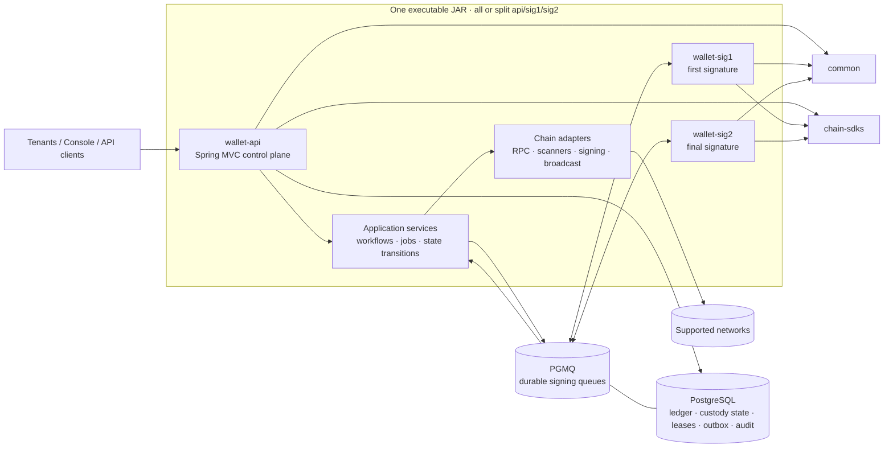

# Surprising Wallet

Surprising Wallet is a multi-tenant blockchain custody platform for exchanges, payment providers, and digital-asset businesses. It provides tenant-isolated deposit addresses, chain monitoring, confirmations, ledger posting, withdrawals, collection, gas accounting, audit trails, and signed webhooks behind one operational control plane.

The project is built for controlled custody operations: PostgreSQL is the source of truth for balances and workflow state, PGMQ transports signing work within the same database, and every enabled chain and asset is controlled through database configuration.

## Supported Chains

The current codebase supports **62 networks across 14 integration groups**. The list below follows `common/.../ChainType.java`. Network activation, RPC endpoints, token configuration, and operational switches are database driven.

Icons are loaded from each project's official website favicon. Every icon and network name links to the official project website.

<table>
<thead>
<tr><th>Integration group</th><th>Supported networks</th></tr>
</thead>
<tbody>
<tr>
<td><strong>Bitcoin-like UTXO</strong></td>
<td><a href="https://bitcoin.org/"></a> BTC &nbsp; <a href="https://litecoin.org/"></a> LTC &nbsp; <a href="https://dogecoin.com/"></a> DOGE &nbsp; <a href="https://bitcoincash.org/"></a> BCH</td>
</tr>
<tr>
<td><strong>EVM and EVM L2</strong></td>
<td><a href="https://ethereum.org/"></a> ETH &nbsp; <a href="https://www.bnbchain.org/"></a> BNB &nbsp; <a href="https://polygon.technology/"></a> Polygon &nbsp; <a href="https://arbitrum.io/"></a> Arbitrum &nbsp; <a href="https://www.optimism.io/"></a> Optimism &nbsp; <a href="https://base.org/"></a> Base &nbsp; <br> &nbsp; <a href="https://www.avax.network/"></a> Avalanche C-Chain &nbsp; <a href="https://hyperliquid.xyz/"></a> HyperEVM &nbsp; <a href="https://www.mantle.xyz/"></a> Mantle &nbsp; <a href="https://linea.build/"></a> Linea &nbsp; <a href="https://scroll.io/"></a> Scroll &nbsp; <a href="https://www.unichain.org/"></a> Unichain &nbsp; <br> &nbsp; <a href="https://zksync.io/"></a> zkSync Era &nbsp; <a href="https://www.berachain.com/"></a> Berachain &nbsp; <a href="https://www.gnosis.io/"></a> Gnosis &nbsp; <a href="https://celo.org/"></a> Celo &nbsp; <a href="https://monad.xyz/"></a> Monad &nbsp; <a href="https://world.org/"></a> World Chain &nbsp; <br> &nbsp; <a href="https://inkonchain.com/"></a> Ink &nbsp; <a href="https://soneium.org/"></a> Soneium &nbsp; <a href="https://katana.network/"></a> Katana &nbsp; <br> &nbsp; <a href="https://megaeth.com/"></a> MegaETH &nbsp; <a href="https://www.xlayer.tech/"></a> X Layer &nbsp; <a href="https://docs.robinhood.com/"></a> Robinhood Chain &nbsp; <a href="https://www.etherlink.com/"></a> Etherlink &nbsp; <br> &nbsp; <a href="https://cronos.org/"></a> Cronos &nbsp; <a href="https://www.soniclabs.com/"></a> Sonic &nbsp; <a href="https://pulsechain.com/"></a> PulseChain &nbsp; <a href="https://somnia.network/"></a> Somnia &nbsp; <br> &nbsp; <a href="https://roninchain.com/"></a> Ronin &nbsp; <a href="https://kaia.io/"></a> Kaia &nbsp; <a href="https://plasma.to/"></a> Plasma &nbsp; <br> &nbsp; <a href="https://www.sei.io/"></a> Sei &nbsp; </td>
</tr>
<tr>
<td><strong>Starknet</strong></td>
<td><a href="https://www.starknet.io/"></a> Starknet</td>
</tr>
<tr>
<td><strong>Hyperliquid</strong></td>
<td><a href="https://hyperliquid.xyz/"></a> HyperCore</td>
</tr>
<tr>
<td><strong>TRON</strong></td>
<td><a href="https://tron.network/"></a> TRON</td>
</tr>
<tr>
<td><strong>XRP Ledger</strong></td>
<td><a href="https://xrpl.org/"></a> XRP</td>
</tr>
<tr>
<td><strong>Solana</strong></td>
<td><a href="https://solana.com/"></a> Solana</td>
</tr>
<tr>
<td><strong>TON</strong></td>
<td><a href="https://ton.org/"></a> TON</td>
</tr>
<tr>
<td><strong>Aptos</strong></td>
<td><a href="https://aptosfoundation.org/"></a> Aptos</td>
</tr>
<tr>
<td><strong>Sui</strong></td>
<td><a href="https://sui.io/"></a> Sui</td>
</tr>
<tr>
<td><strong>Cardano</strong></td>
<td><a href="https://cardano.org/"></a> Cardano</td>
</tr>
<tr>
<td><strong>Polkadot</strong></td>
<td><a href="https://polkadot.com/"></a> Polkadot</td>
</tr>
<tr>
<td><strong>NEAR</strong></td>
<td><a href="https://near.org/"></a> NEAR</td>
</tr>
<tr>
<td><strong>Monero</strong></td>
<td><a href="https://www.getmonero.org/"></a> Monero</td>
</tr>
</tbody>
</table>

## Architecture


```mermaid
flowchart LR
    subgraph Runtime["One executable JAR · all or split api/sig1/sig2"]
    API
    Services
    Adapters
    Sig1
    Sig2
    end
    Tenant[Tenants / Console / API clients] --> API[wallet-api<br/>Spring MVC control plane]
    API --> Services[Application services<br/>workflows · jobs · state transitions]
    Services --> Adapters[Chain adapters<br/>RPC · scanners · signing · broadcast]
    Adapters --> Networks[(Supported networks)]
    API --> PostgreSQL[(PostgreSQL<br/>ledger · custody state · leases · outbox · audit)]
    Services --> PGMQ[(PGMQ<br/>durable signing queues)]
    PGMQ --- PostgreSQL
    PGMQ <--> Sig1[wallet-sig1<br/>first signature]
    PGMQ <--> Sig2[wallet-sig2<br/>final signature]
    PGMQ --> Services
    API --> Common[common]
    Sig1 --> Common
    Sig2 --> Common
    API --> SDKs[chain-sdks]
    Sig1 --> SDKs
    Sig2 --> SDKs
```

| Module | Responsibility |
|---|---|
| `wallet-api` | Spring MVC API and console, scheduled jobs, custody workflows, chain adapters, repositories, gas accounting, webhooks, and startup validation. |
| `wallet-sig1` | First signature library for Bitcoin-like withdrawal transactions. |
| `wallet-sig2` | Final signing library; completed transactions return to the API through PGMQ for broadcasting. |
| `common` | Shared chain and asset contracts, signing DTOs, wallet key configuration, and cross-module infrastructure. |
| `chain-sdks` | Bitcoin-like, TRON, RPC, UTXO, BIP32, Ed25519, and Protobuf based SDK components. |

The dependency direction is `wallet-api → wallet-sig1, wallet-sig2, common, chain-sdks` and `wallet-sig1/wallet-sig2 → common, chain-sdks`. Inside `wallet-api`, controllers and jobs handle boundaries and scheduling; services own workflows; chain, gateway, coordinator, observer, repository, and configuration packages implement the domain and infrastructure layers. Each SQL repository is responsible for one table.

## Deployment

### Requirements

- JDK 27
- Maven 3.9+
- PostgreSQL 18
- PGMQ 1.11.1 extension installed on the PostgreSQL server
- Node.js only for the Polkadot runtime bridge and selected test infrastructure

### Local development or a disposable test database

The repository has one canonical database file. It is destructive by design and must be used only with a new or disposable database. Install PGMQ 1.11.1 on the existing PostgreSQL server first (commands below); initialize as a database administrator.

```bash
createdb -h 127.0.0.1 -p 5432 surprising_wallet_test_local
psql -h 127.0.0.1 -p 5432 -d surprising_wallet_test_local -v ON_ERROR_STOP=1 -f resources/docs/db/surprising-wallet-init-pgsql.sql
export SW_DB_URL=jdbc:postgresql://127.0.0.1:5432/surprising_wallet_test_local

mvn -pl wallet-api -am clean package
java -jar wallet-api/target/wallet-api-1.0.0-SNAPSHOT.jar --sw.wallet.mode=all
```

Configure queue access for the API and separate signing roles as described in [startup and testing](resources/docs/zh/startup-and-testing.md#pgmq-队列运行与验证). Split processes use the same `SW_DB_URL`; signers use `SW_SIG1_DB_USERNAME/PASSWORD` and `SW_SIG2_DB_USERNAME/PASSWORD`.

Disable the development faucet with `SW_WALLET_DEV_FAUCET_ENABLED=false` unless its funding configuration is complete.

Set the database, custody master key, platform administrator, wallet key, CORS, and chain RPC environment variables before starting the services. Do not put private keys, seed phrases, production credentials, or RPC secrets in Git.

Only `wallet-api` produces an executable JAR; both signer libraries are bundled inside it. Choose a mode with `--sw.wallet.mode` or `SW_WALLET_MODE`:

| Mode | Components | HTTP |
|---|---|---|
| `all` | API, chain jobs, both signers; one database pool, separate schedulers | Yes |
| `api` (default) | API, chain jobs, broadcasting | Yes |
| `sig1` | First signer | No |
| `sig2` | Second signer | No |

For split deployment, run the same JAR three times with `api`, `sig1`, and `sig2`, using separate environment files. Do not run `all` alongside the split services.

| Mode | Required key variables, prefixed with `SW_WALLET_` |
|---|---|
| `all` | `SIG1_SEED`, `SIG2_SEED`, `ED25519_SEED`, `RECOVERY_PUBLIC_ROOT` |
| `api` | `SIG2_SEED`, `ED25519_SEED`, `SIG1_PUBLIC_ROOT`, `RECOVERY_PUBLIC_ROOT` |
| `sig1` | `SIG1_SEED`, `SIG2_PUBLIC_ROOT`, `RECOVERY_PUBLIC_ROOT` |
| `sig2` | `SIG2_SEED` |

Seeds are Base64-encoded 32-byte values; public roots are BIP32 extended public keys exported from the corresponding existing roots. Keep the recovery seed offline. API account-chain signing still requires sig2 and Ed25519 private material. `all` keeps both signing keys in one process and offers no process-level key isolation.

### Linux systemd deployment

The repository includes service units for the API and both signing services under `resources/infra/systemd/`.

1. Provision PostgreSQL 18 with PGMQ 1.11.1. Install the extension files on the existing database host before running the initialization SQL:

   ```bash
   git clone --depth 1 --branch v1.11.1 https://github.com/pgmq/pgmq.git /tmp/wallet-pgmq
   make -C /tmp/wallet-pgmq/pgmq-extension
   make -C /tmp/wallet-pgmq/pgmq-extension install
   ```
2. Initialize a new database with `resources/docs/db/surprising-wallet-init-pgsql.sql`.
3. Install `/etc/surprising-wallet/wallet.env`; split deployments also need `sig1.env` and `sig2.env`, containing only each role's configuration.
4. Install the units. For one process, enable `surprising-wallet-all.service`; for split deployment, enable `surprising-wallet.service`, `surprising-wallet-sig1.service`, and `surprising-wallet-sig2.service`.
5. Disable the unused layout before starting the selected services. All units use `current/wallet-server.jar`.

The service units run as the unprivileged `wallet` user. The API health endpoint is `/actuator/health`.

### Automated backend deployment

`.github/workflows/deploy-backend-dev.yml` builds with JDK 27 and Lombok 1.18.48 on GitHub Actions, runs unit tests, and uploads one checksummed release archive to the Alibaba Cloud host over SSH. The server runs only `surprising-wallet-all.service`; it does not need Maven or a Git checkout. PostgreSQL and HTTP bind to loopback; Nginx provides the public entry point. Database integration tests use the developer machine's existing PostgreSQL 18 before release.

Configure `BACKEND_DEPLOY_HOST`, `BACKEND_DEPLOY_USER`, `BACKEND_DEPLOY_SSH_KEY`, and `BACKEND_DEPLOY_KNOWN_HOSTS` in repository secrets. Pin the host key. Install `scripts/deploy/backend-deploy-trigger.sh` as `/usr/local/sbin/surprising-wallet-backend-deploy` and authorize the dedicated key with `restrict,command="/usr/local/sbin/surprising-wallet-backend-deploy"`.

The receiver checks the archive digest and file list, serializes deployments, checks database prerequisites, stages an immutable release, updates the unit, and verifies health. A failed activation restores the previous JAR and unit when available. Environment files and databases are never replaced by automatic deployment; configuration changes require their own backups. The all-mode unit caps the heap at 640 MiB; size connection pools and enabled chain workloads to fit the host.

The canonical initialization SQL is applied only once to a new, explicitly provisioned database. Never run it during automatic deployment. Supply `SW_CUSTODY_SECRET_MASTER_KEY` and the mode-specific key variables; development faucet jobs are disabled by default. ZKSYNC profiles and USDC are retained but disabled together until explicitly configured.
