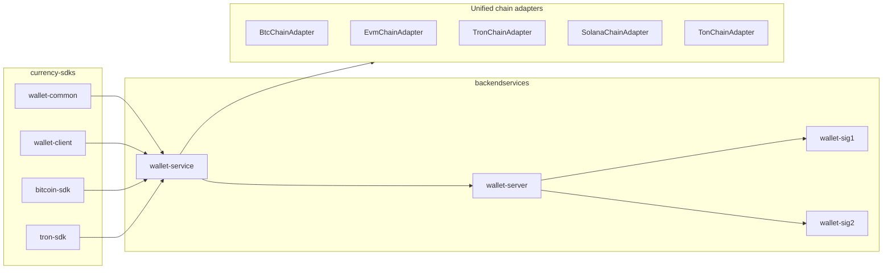

# Multi-Chain Wallet Architecture

## Text Version

- `BTC` stays isolated as the UTXO engine.
- `EVM` chains share one account-model engine.
- `TRON` is a separate account-model family with resource accounting.
- `SOLANA` and `TON` are modeled as future-chain adapters now, so the system can expand without changing the BTC core.
- `wallet-service` is the domain layer.
- `wallet-server` is the job/orchestration layer.
- `bitcoin-sdk` is the BTC algorithm layer.
- `wallet-common` is the shared chain and asset model layer.

## Diagram Version

## Design Notes

1. BTC is not refactored into the common account engine.
2. EVM networks differ only by RPC URL, chain ID, gas policy, and token registry rows.
3. TRON is split from EVM because energy and bandwidth are not equivalent to gas.
4. All chain metadata is represented with explicit model objects instead of hidden constants.
5. New chain support should be added by registering a new adapter and data rows, not by editing BTC code paths.
