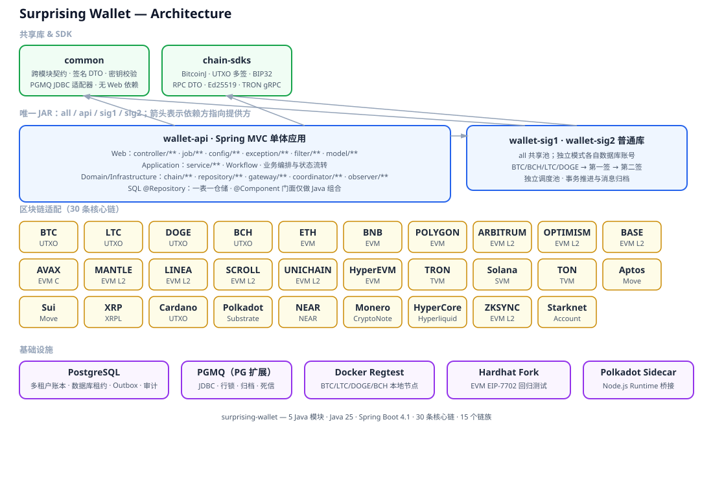

# 架构

全模块位于项目根目录，扁平 Maven 多模块布局。



## Custody 控制面

多租户托管层位于现有链引擎之上：

```text
平台 Console -> 租户生命周期
租户 Console/API -> 租户范围的地址、资产、充值、提现
                         |
                         v
                 现有钱包账本和链引擎
                         |
                         v
                 扫链 / 签名 / RPC 服务
```

租户身份始终来自 Console 会话或 API 凭证。公开地址 API 接收 `chainId` 和租户定义的
`subject` 和可选的 `addressVersion`；同一租户、链、subject 和版本重复调用返回同一地址，递增版本可更换地址，相同 subject 和版本的所有 EVM 链地址一致。扫链确认入账后，会在同一数据库事务中映射 Custody 充值、
租户资产和持久化 Webhook 事件。详见[多租户托管钱包](multi-tenant-custody.md)。

## 发布部署

GitHub Actions 使用 JDK 27 / Lombok 1.18.48 构建并执行单元测试，随后通过固定主机公钥、专用受限 SSH 密钥上传带摘要的单 JAR 发布包。阿里云主机只运行 all 模式，不执行 Maven 构建。上传接收器校验摘要和文件名单，以文件锁串行发布；切换失败时恢复旧 JAR 和 systemd unit。部署不执行初始化 SQL，不替换密钥或数据库；旧服务器的发布入口停用。

新主机 PostgreSQL 18 + PGMQ 1.11.1 与应用共机运行，数据库和应用 HTTP 绑定 loopback，公网入口由 Nginx 提供。640 MiB 堆上限配合有限数据库连接池，适用于低负载起步；开链数量仍需按实际负载控制。

运行监控独立于钱包 JVM：systemd 每分钟启动 Python 只读探针，读取主机资源、服务、日志、PostgreSQL/PGMQ 指标及本机/公网健康结果，通过 Telegram 发送故障、恢复和日报。第二台主机仅探测公网 HTTPS，覆盖钱包主机整体宕机；没有额外中间件，也不处理业务队列。日志有时间与容量限制，详见[日志与运行监控](operations-monitoring.md)。

## 运行模型

`wallet-api` 是唯一可执行 JAR，包含两个普通签名库；默认 `api`。

| `sw.wallet.mode` | 加载组件 | HTTP | 数据源 |
|---|---|---|---|
| `all` | API、链任务、第一签、第二签 | 开启 | 一个共享池 |
| `api` | API、链任务、广播 | 开启 | API 账号 |
| `sig1` | 第一签 | 关闭 | 第一签账号 |
| `sig2` | 第二签 | 关闭 | 第二签账号 |

bootstrap 包按模式显式扫描组件；签名 Bean 使用全限定名称避免冲突。第一签和第二签分别绑定单线程 `sig1TaskScheduler`、`sig2TaskScheduler`，API 保持按 Job 类别分池。签名密钥通过限定名称注入，第二签不保留静态私钥或 HTTP 签名入口。所有模式仍通过 PGMQ 推进阶段；合并进程不改变消息重试、幂等和审计路径。


运行时资产来源：

| 表 | 作用 |
|---|---|
| `chain_profile` | 链 key、链族、启用网络、确认策略、扫描/提现/归集/划转开关、扫描起始高度、BIP44 coin type、Starknet account class hash |
| `chain_rpc_node` | 每条链的 RPC/fullnode/indexer/faucet 节点、环境标签、优先级、认证和备注 |
| `wallet_system_config` | 全局扫描/提现/归集/划转总开关 |
| `chain_asset` | 原生资产和链内资产定义 |
| `token_config` | token 合约/配置、decimals、归集/提现策略 |
| `ledger_balance` | 按链隔离的用户/系统余额状态 |
| `custody_*` | 租户、凭证、地址分配、充提投影、Webhook、幂等和审计控制面状态 |

应用应通过 `chain + symbol` 或 `chain + contract` 解析资产，然后把 runtime asset 传入 scanner、withdraw、collection 和 signing 流程。

## 模块

| 模块 | 职责 |
|---|---|
| `wallet-api` | Spring MVC 单体应用：Custody/Console REST API、Servlet/Cookie 与 HTTP 异常映射、Job 调度、业务 Service、链领域与持久化模型、链适配器（Bitcoin-like/EVM/Starknet/TRON/Solana/TON/Aptos/Sui/XRP/Cardano/Polkadot/NEAR/Monero/HyperEVM/HyperCore）、充值、账本、提现、归集、Gas、Webhook 和启动校验 |
| `wallet-sig1` | BTC-like 2-of-3 第一签服务：对 BTC、BCH、LTC、DOGE 提现交易生成部分签名，轮询 PostgreSQL / PGMQ 队列；处理中任务可恢复 |
| `wallet-sig2` | 第二签服务：完成最终签名并入 PGMQ 广播队列，由 wallet-api 广播；处理中任务可恢复 |
| `common` | 无 Web 耦合、至少被两个上层模块使用的共享契约和 PGMQ 基础设施：运行时链/资产契约、签名交易 DTO、钱包密钥配置与加载、通用常量 |
| `chain-sdks` | 与业务和数据库无关的链 SDK：BitcoinJ 网络参数、Bitcoin-like RPC DTO、多签地址、SegWit 交易、UTXO 选择、BIP32、SLIP-0010 Ed25519 派生与签名、TRON gRPC/Protobuf/ECKey |

所有模块的 parent POM 为根目录 `pom.xml`，继承 Spring Boot starter parent，以 Java 27 作为统一编译和运行基线，并提供统一的版本和依赖管理。

模块依赖遵循 `wallet-api -> wallet-sig1, wallet-sig2, common, chain-sdks`，签名服务分别直接依赖共享库和链 SDK。`wallet-api`
内部采用 MVC 分层：Servlet 请求、Cookie 读写和 HTTP 状态映射只存在于 Web 层的 Controller、Filter
和异常处理器；Controller 只做参数校验和响应映射，Job 只负责调度、节流、防并发和异常隔离，选币、状态流转、队列消费、RPC 调用和审计由业务 Service 承担。
Web 层包固定为 `controller/`、`job/`、`config/`、`exception/`、`filter/` 和 `model/`；认证过滤器及其
Servlet 请求包装器不得放入 `config/`，充值扫描使用的检查点模型归入 `chain/model/`。链上网关统一位于
`com.surprising.wallet.gateway`，链操作协调器统一位于 `com.surprising.wallet.coordinator`，二者不得放回
`service/` 包；协调器使用 `@Component`，业务工作流才使用 `@Service`。
所有应用 Service（包括工作流和实现类）统一位于 `com.surprising.wallet.service`，使用 `service/**` 单层包，
不再按业务域拆分 `account/service`、`custody/service` 或 `devfaucet/service`，也不保留 `impl` 子包。
所有业务域的 PostgreSQL/JDBC Repository 统一位于 `com.surprising.wallet.repository`，业务包下不再保留
`account/repository`、`custody/repository`、`deposit/repository` 或其他分散的 Repository 子包。
Service 和 Job 统一使用构造器注入；可选基础设施依赖以 `Optional<T>` 表达。
`common.queue` 提供无 Web 依赖的 PGMQ JDBC 适配器和消费事务执行器，唯一启动入口显式导入配置。
业务 Service 通过适配器使用队列，不直接编写 SQL；`ChainFeeRateRepository` 只访问 `chain_fee_rate`。

各模块分别声明自身实际使用的 starter，避免依赖传递造成的隐式可用。

Repository 采用“单表一仓储”约束：每个 `@Repository` 只访问一个数据库表，Repository 名称与表职责一一对应。
`CustodyRepository`、`ChainJdbcRepository` 等保留名称的跨表门面使用 `@Component`，自身不执行 SQL，只在 Java 中组合
单表仓储并维护必要的事务边界；它们不属于 SQL Repository。Service 不持有 `JdbcTemplate`、不执行 SQL，负责业务规则
和工作流调用。任何 SQL Repository 内禁止使用 JOIN、跨表子查询或同时读写多张业务表。

`com.surprising.wallet.chain.model`、业务数据库记录和转账请求模型属于 `wallet-api` 内部领域层。
Bitcoin-like RPC DTO 与 Ed25519 链枚举、派生结果和 SLIP-0010 密钥提供者位于 `chain-sdks`；`common`
不直接声明 BitcoinJ 或 EdDSA，也不再通过全局 `Constants.NET_PARAMS` 暴露链 SDK 类型。数据库/JDBC
模型不得进入 `chain-sdks`。

## 调度与运行时开关

- wallet-api 的每个 `@Scheduled` 入口都通过 `wallet_task_lease` 获取数据库租约；租约按任务名唯一，执行期间由心跳续租，实例故障后由其他实例接管。租约只负责调度所有权，业务数据仍由各自的事务和单表 Repository 维护。
- 独立 sig1/sig2 模式使用独立账号连接同一个 PostgreSQL，仅访问授权的 PGMQ 队列。消费按消息领取，处理事务持有该消息行锁；read_ct 校验阻止旧消费者确认新领取的消息。
- 签名任务与业务状态同事务写入 `wallet_outbox`；派发器将 PGMQ 入队和 Outbox 标记成功放在同一事务。消费事务原子完成业务状态更新、下一阶段入队和当前消息归档。异常回滚，指数退避重试；第 20 次失败进入死信队列。
- 提现领取按 `tenant_id` 轮转，Webhook 领取按租户公平排序；任何租户的慢 RPC、慢回调或积压都不能长期饿死其他租户。幂等键、状态机、锁定余额、失败释放和链上对账共同构成资金闭环。
- Account-Chain 调度器每秒做轻量到期检查，UTXO 调度器每 5 秒检查；只有达到该链扫描周期时才访问 RPC。
- 扫描周期由 `WalletRuntimeConfigService` 集中维护，快速链为 2-5 秒，ETH 为 12 秒，ADA 为 20 秒，DOGE/LTC/BTC/BCH 为 15/30/60/60 秒，未知新链默认 10 秒。
- 每次实际执行都实时读取 PostgreSQL 中的 `global.all.enabled`、全局任务开关和 `chain_profile` 链级任务开关，后台修改无需重启。
- 开关关闭时阻止新的扫描、提现构建、归集和转账动作；已广播交易的确认、对账与回调继续运行，避免资金状态永久停留在中间态。
- XMR 使用独立串行全流程任务，不再由通用 Account-Chain 扫描任务重复执行。

## 链族

| 链族 | 链 | 本地测试支持 | live/testnet 支持 |
|---|---|---|---|
| Bitcoin-like UTXO | BTC, LTC, DOGE, BCH | Docker regtest 节点 | 外部 RPC 配置 |
| EVM | ETH, BNB, POLYGON, BERACHAIN, GNOSIS, MONAD, CRONOS, SONIC, PULSECHAIN, SOMNIA, RONIN, KAIA, PLASMA, SEI | Hardhat fork | Sepolia、BSC testnet、Amoy、Berachain Bepolia、Gnosis Chiado、Monad Testnet、Cronos Testnet、Sonic Testnet、PulseChain Testnet V4、Somnia Shannon、Ronin Saigon、Kaia Kairos、Plasma Testnet、Sei Atlantic-2 |
| EVM L2 / L3 | ARBITRUM, OPTIMISM, BASE, AVAX_C, CELO, WORLD_CHAIN, INK, SONEIUM, KATANA, MEGAETH, X_LAYER, ROBINHOOD_CHAIN, ETHERLINK, ZKSYNC | Hardhat fork | Sepolia L2、Avalanche Fuji、Celo Sepolia、World Chain Sepolia、Ink Sepolia、Soneium Minato、Katana Bokuto、MegaETH Carrot、X Layer Testnet、Robinhood Chain Testnet、Etherlink Shadownet、zkSync Sepolia |
| EVM L2 (新增) | MANTLE, LINEA, SCROLL, UNICHAIN, HyperEVM | Hardhat fork | Mantle Sepolia、Linea Sepolia、Scroll Sepolia、Unichain Sepolia、HyperEVM testnet |
| Starknet | STARKNET | 本地 Starknet Devnet 完整流程 | Sepolia / Mainnet（RPC、账户 class hash 和 Token 配置经审批后启用） |
| TRON | TRON | DB 测试 | Nile live flow |
| Solana | SOL | DB 测试 | Devnet live flow |
| TON | TON | DB 测试 | Testnet |
| Aptos | APT | DB 测试 | Testnet |
| Sui | SUI | DB 测试 | Testnet |
| XRP | XRP | DB 测试 | Testnet |
| Cardano | ADA | DB 测试 | Preprod testnet |
| Polkadot | DOT | 本地 dev 链 + Node.js Sidecar | Westend + Asset Hub |
| NEAR | NEAR | DB 测试 | Testnet |
| Monero | XMR | Docker regtest wallet-rpc | Testnet |
| HyperCore | HYPE | DB/API 测试 | Hyperliquid testnet API |

HyperEVM 复用 EVM 通用路径。HyperCore 使用独立的账户层适配器，通过 Hyperliquid `/info` 和 `/exchange` API 工作。Polkadot 通过 `resources/infra/polkadot-runtime-service` Node.js 桥接服务与链交互。参见 [HyperEVM 与 HyperCore 接入说明](hyperevm-hypercore.md)。

## 签名模型

密钥通过环境变量注入唯一 application.yaml，按模式加载本方 Seed 与必要的扩展公钥。恢复私钥离线保存，运行时只配置 recovery-public-root。api 保留账户链使用的 sig2 和 Ed25519 私钥；sig1 / sig2 各自只要求本方 Seed。all 同一进程持有两方私钥，不提供进程级密钥隔离。Bitcoin-like 链使用其中三组 BIP32 root：

```text
BIP32 root #1 -> pubKey1，在线第一签私钥 root
BIP32 root #2 -> pubKey2，在线第二签私钥 root
BIP32 root #3 -> pubKey3，离线恢复私钥 root
```

SOL/TON/APTOS/SUI 使用第四个 Ed25519 master seed：

```text
Ed25519 Seed -> SLIP-0010 Ed25519 派生 -> 每条链/每个用户 key
```

生产环境不要把 BIP32 raw seed 复用为 Ed25519 seed。不同生产根密钥材料应隔离。

## 主流程边界

Scanner：

- 读取链状态。
- 匹配 `chain_address` 中注册的地址。
- 向 `deposit_record` 写入归一化充值事件。
- 幂等入账 `ledger_balance`。

Withdraw：

- 从数据库解析资产配置。
- 锁定 ledger balance。
- 构建、签名、广播交易。
- 确认并释放/完成 ledger 状态。

Collection：

- 扫描可归集用户余额。
- 从 `token_config` 读取资产策略。
- 构建到固定默认热提钱包的转账；默认热提钱包为每条链原生资产 `chain_address` 的 `user_id=0/biz=0/address_index=0/wallet_role=DEPOSIT`。
- 确认并幂等更新 ledger 状态。

## 启动配置校验

wallet-api 启动时会先校验当前模式所需的 `sw.wallet.keys`，再检查 `chain_profile`、`chain_rpc_node`、默认热提钱包和 `wallet_system_config`。密钥配置缺失或非法会直接启动失败；校验通过后，默认热提钱包会通过代码推导并与 `chain_address` 比对，缺失或不一致同样会启动失败。同一链同一时刻只能启用一个网络；非生产环境可以同时保存 devnet/testnet profile 并切换启用，生产环境只允许启用生产网络。启用 profile 必须至少有一个匹配当前环境的 RPC 节点。校验结果会按链打印状态，缺失配置或关闭开关会输出 WARN。

## 运行目录

`resources/` 下集中存放 infra（EVM fork、Polkadot sidecar、regtest、Move 合约、systemd 服务）、docs（文档、SQL）和 scripts（测试启动脚本）。

### PostgreSQL 队列与费用报价

PGMQ 扩展管理 `pgmq.q_wallet_*`、对应归档表和死信队列。`common.queue.PgmqClient` 只访问扩展对象，不访问业务表。
`ChainFeeRateRepository` 对应 `chain_fee_rate`（链、整数费率、更新时间），经 `ChainFeeRateService` 为提现和 RBF 提供网络报价。
队列消费由 `WithdrawalQueueService`、`FirstSigningService`、`SecondSigningService` 和 `RbfBumpService` 编排；Job 仅调度。
已移除独立失败重试和超时重投签名 Job，PGMQ 未确认消息在可见性超时后恢复。
队列归档用于审计；运维使用 `wallet_replay_dead(queue, id, reason)` 重放死信，并记录数据库操作者和原因。
PGMQ 的消息行锁与 read_ct 校验保证领取和确认安全，链上 RPC 仍须依赖交易 ID 幂等及未知结果对账。
