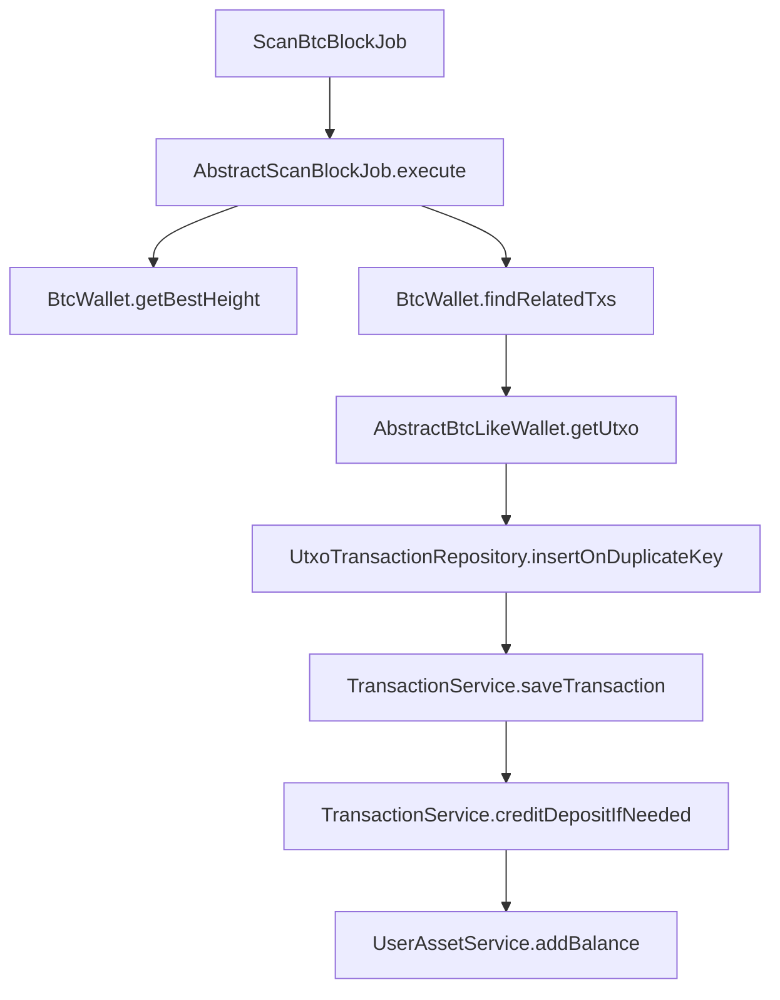
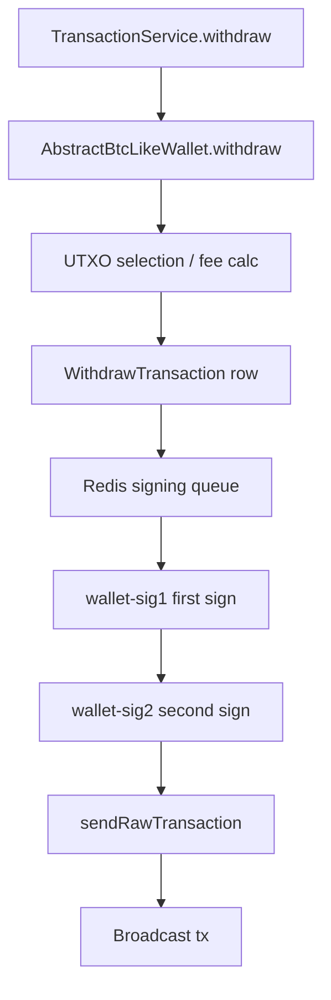
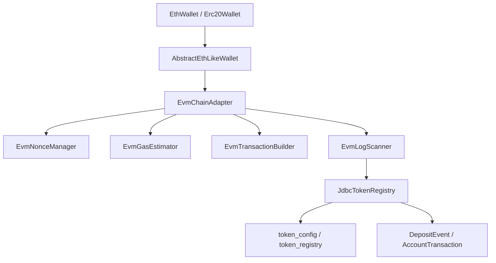
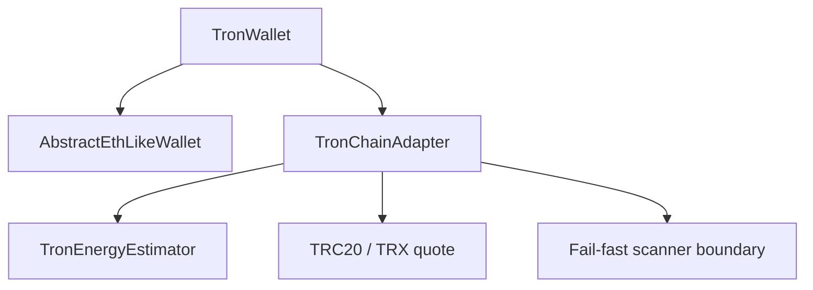
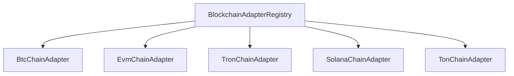

# System Code Flow

## 1. BTC deposit flow

1. `ScanBtcBlockJob` starts the BTC scan job.
2. `AbstractScanBlockJob.execute` resolves the best height, DB height, and scan range.
3. `BtcWallet.getBestHeight` asks the BTC RPC for the current chain height.
4. `BtcWallet.findRelatedTxs` parses each block transaction and extracts BTC outputs to system addresses.
5. `AbstractBtcLikeWallet.getUtxo` normalizes each output into a `UtxoTransaction`.
6. `UtxoTransactionRepository.insertOnDuplicateKey` keeps deposit rows idempotent.
7. `TransactionService.saveTransaction` pushes the deposit to the business queue.
8. `TransactionService.creditDepositIfNeeded` credits user balance once confirmations are sufficient.

## 2. BTC withdrawal flow

1. `TransactionService.withdraw` freezes user assets and creates a withdraw record.
2. `AbstractBtcLikeWallet.withdraw` checks hot-wallet balance and delegates to BTC transaction construction.
3. Fee calculation is SegWit vbytes-based and remains BTC-specific.
4. `WithdrawTransaction` is stored as the signing job payload.
5. Redis is used as the signing pipeline handoff.
6. `wallet-sig1` produces the first witness.
7. `wallet-sig2` completes the second signature and validates the witness.
8. `sendRawTransaction` broadcasts the signed BTC transaction.

## 3. EVM / ERC20 flow

1. `EthWallet` keeps the existing ETH + ERC20 entrypoint.
2. `AbstractEthLikeWallet` still owns the current account-model deposit and withdraw logic.
3. `EvmChainAdapter` is the unified EVM engine facade.
4. `EvmNonceManager` allocates deterministic nonces per chain/address.
5. `EvmGasEstimator` produces chain-aware fee quotes.
6. `EvmTransactionBuilder` builds native and ERC20 transfer payloads.
7. `EvmLogScanner` converts logs into normalized deposit events.
8. `JdbcTokenRegistry` reads enabled token metadata from `token_config`, then falls back to legacy `token_registry`.
9. Generic `scanDeposits` is fail-fast until an RPC-backed scanner runtime is attached.

## 4. TRON flow

1. `TronWallet` keeps the current TRX transfer and scan entrypoint.
2. `TronChainAdapter` exposes the unified TRON family interface.
3. `TronEnergyEstimator` models bandwidth and energy usage.
4. TRX and TRC20 quote paths are separated from EVM logic.
5. Generic TRON scanner calls fail fast until a real RPC-backed `TronScanner` is wired, so deposits cannot be silently missed.

## 5. Future chain flow

1. `BlockchainAdapterRegistry` is the single lookup point for chain engines.
2. BTC remains isolated.
3. EVM chains share one engine and multiple profiles.
4. TRON has its own resource model.
5. Solana and TON are represented as future-chain adapters with explicit unsupported transfer quotes and fail-fast scanners until their runtime connectors are enabled.
